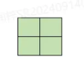

# 2、俄罗斯方块
在俄罗斯方块游戏中，只有下面1种大方块，由四个正方形小方块组成。现在，请计算在给定网格大小的情况下，最多可以放置多少个大方块。  
具体规则如下：  
1、网格为正方形网络。
2、方块不能重叠。
3、方块不能超出网格的边界。
4、网格中部分位置不能放置方块。  
  
##  输入
n k
y1 x1
y2 x2
表示边长为n的正方形网格，有k个位置不能放置方块，接下来k行坐标对，y表示自上向下的第几行，x表示自左向右的第几列（坐标从0开始编号，左上角为0 0）。  
n的范围：[1,8]  
k的范围：[0,64]  
x、y的范围：[0,n)
## 输出
最多能放下多少大方块